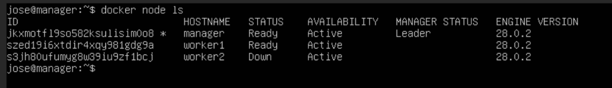
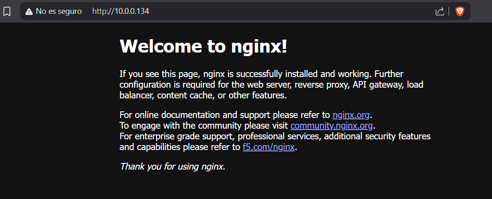
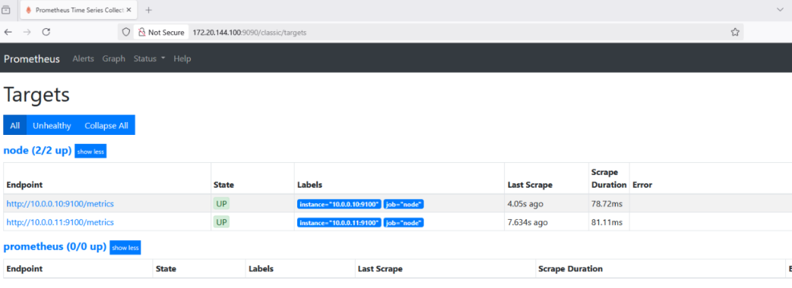
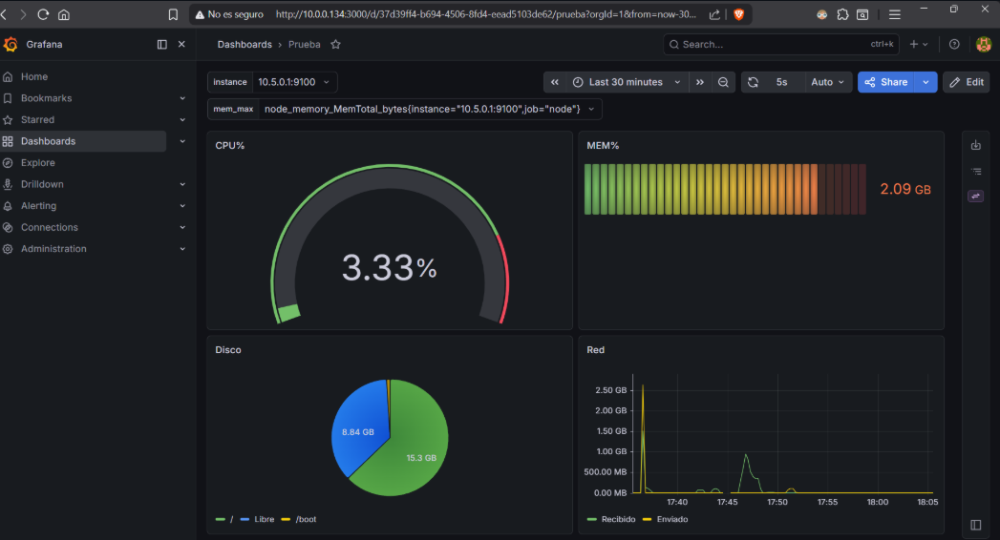
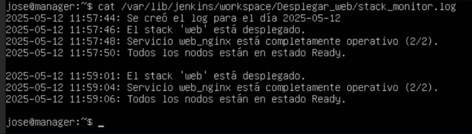

# Proyecto de balanceador de carga, CI/CD y monitorización de infraestructura.
El proyecto permite:
- Recopilar métricas de multiples servidores mediante <u>Prometheus</u> y <u>Node Exporter</u>.
- Visualizar la información recopilada en paneles interactivos y peersonalizables con <u>Grafana</u>.
- Automatizar el despliegue de servicios con <u>Jenkins</u>.
- Ejecutar un balanceador de carga mediante <u>Docker Swarm</u>.
- Permite escalado horizontal añadiendo más ordenadores (nodos).

## Instalación Rápida
1. ✅ [**Paso 1: Valida requisitos**](docs/01-prerequisites.md)
   - ¿Tienes 3 máquinas? ¿Ubuntu instalado? ¿Docker disponible?

2. 🌐 [**Paso 2: Configura la red**](docs/02-network-setup.md)
   - Asigna IPs a cada máquina
   - Configura el manager como router

3. 🐳 [**Paso 3: Crea la Docker Swarm**](docs/03-swarm-setup.md)
   - Inicia Swarm en el manager
   - Une los workers

4. 📊 [**Paso 4: Instala servicios**](docs/04-services-setup.md)
   - Prometheus, Grafana y Jenkins en el manager

5. ✔️ [**Paso 5: Valida la instalación**](docs/05-post-deploy.md)
   - Accede a los dashboards
   - Verifica que todo funciona

  

# 📑 Tabla de Contenidos
- [¿Qué es este proyecto?](#qué-es-este-proyecto)
- [Conceptos básicos](#conceptos-básicos)
- [Ejemplo de implementación](#ejemplo-de-implementación)
- [Requisitos Mínimos](#requisitos-mínimos)
- [Servicios disponibles](#servicios-disponibles-tras-el-despliegue)
- [Próximos Pasos](#próximos-pasos)
- [Referencias Externas](#referencias-externas)

## ¿Qué es este proyecto?
Este proyecto surgió como un <u>Trabajo de Final de Grado</u> del Grado Superior de **ASIR**.

En él se busca suplir la necesidad de las empresas por tener **servidores resilientes** y con **alta disponibilidad** pero sin depender de servidores de terceros como AWS y con herramientas y servicios comúnmente conocidos por cualquier administrador de sistemas, como por ejemplo **Jenkins, Docker, Grafana, etc.**

De esta forma, las empresas tendrán la capacidad de implementar sus propios servidores de una manera sencilla y automatizada siempre y cuando tengan la estructura física y de red necesaria.

## Conceptos básicos

### ¿Qué es Docker Swarm?
Es un orquestador de contenedores que se encargará de distribuir servicios (aplicaciones) en diferentes ordenadores. Además, actúa también como un <u>balanceador de carga nativo</u>.
Gracias a éste se pueden desplegar nuevos servicios o eliminar servicios ya existentes de manera <u>centralizada y remota</u>.

📷 Ver ejemplo

En este proyecto, se usará principalmente para desplegar un **servidor web** y un recopilador de métricas en cada ordenador.

### ¿Qué es Nginx?
Es uno de los servicios que desplegará Docker Swarm, y que simplemente se encarga de desplegar un servidor web en cada ordenador que nosotros le indiquemos.

📷 Ver ejemplo

El contenido de la web depende completamente de las necesidades de la persona o empresa en cuestión.

### ¿Qué es Node Exporter?
Es otro de los servicios que desplegará Docker Swarm y se encarga de la recopilación de métricas del sistema en cuestión (como % de uso de CPU, memoria utilizada, espacio libre en disco, etc.).

Estas métricas serán recopiladas posteriormente por Prometheus.

### ¿Qué es Prometheus?
Es un servicio que se encargará de recopilar y centralizar todas las fuentes de información de los diferentes ordenadores.

📷 Ver ejemplo

Básicamente, ofrece una interfaz web a través de la cual poder consultar los datos de TODOS los ordenadores generados por Node Exporter.

### ¿Qué es Grafana?
Es un servicio que se encargará de recopilar la información que ha obtenido Prometheus y exponerla a través de grafos y que permite separar la información por colores para mayor claridad visual.

📷 Ver ejemplo

Será la manera en la que consultaremos los datos de forma más bonita.

### ¿Qué es Jenkins?
Es un servicio que se encarga de la automatización de tareas en diferentes nodos.

En este caso, se encargará principalmente de asegurarse que el servicio web (nginx) se encuentre siempre desplegado.

Si **no** es el caso, lo volverá a intentar desplegar indefinidamente, y generará un archivo .log acorde dependiendo de si el servicio se encuentra desplegado o no. Se ejecutará cada **5 minutos** ajustable según las necesidades.

📷 Ver ejemplo

## Ejemplo de implementación
Explicado todo lo anterior, a continuación se muestra un ejemplo de implementación del proyecto DENTRO de una infraestructura LAN, sin tener en cuenta la posibilidad de que los servicios ejecutados sean accesibles desde Internet (básicamente, para uso interno exclusivamente).

En la imágen se ve que el **Nodo Manager** actúa como intermediario entre ambas redes. Las peticiones que los clientes deseen hacer deberán ser realizadas a este mismo ordenador, el cuál se encargará de dirigir las peticiones a los diferentes **Nodos Worker** en función de la carga que tengan ambos, utilizando principalmente el protocolo **Round Robin**.

### Red LAN
Será la red desde la que los clientes accederán a los servicios desplegados (servicio web, de correo, etc.) y desde la que el Administrador tendrá acceso a los servicios más internos y sensibles (Prometheus, Grafana, Jenkins, etc.)

### Red SWARM
Será la red en donde se encuentren los servidores que hostearán las aplicaciones finales (las que se llevarán la mayor carga de trabajo).

Esta red está pensada para que sea fácilmente escalable, ya que si se desean añadir nuevos servidores o sustituir otros viejos, simplemente habrá que conectarlos a esta red y ejecutar un par de comandos.

### Nodos MANAGER y WORKER
El <u>**Nodo Manager**</u> será el que separe la **Red LAN** de la **Red SWARM**. También será el encargado de dar acceso a Internet a los servidores en caso de que éstos lo requieran para, principalmente, actualizaciones del sistema.

Por último, se encargan de centralizar el despliegue de los servicios. Cualquier servicio que se desee desplegar se desplegará directamente desde este ordenador, el cuál se encargará de desplegar el servicio en cuestión en el resto de servidores.

Esto elimina la necesidad de ir uno por uno implementándolo y evita que los servidores lleguen a ejecutar versiones diferentes de la aplicación o servicio debido a falta de dependencias entre ordenadores.

Por otro lado, los <u>**Nodos Worker**</u> serán los encargados de hostear el servicio o aplicación final. Son orquestados por el **Nodo Manager** y simplemente se limitan a seguir las órdenes que éste mismo les dé.

## Requisitos Mínimos

| Aspecto | Requisito |
|---------|-----------|
| **Máquinas** | 3 (1 Manager + 2 Workers) |
| **SO** | Ubuntu Server 20.04+ |
| **CPU** | 2 núcleos mínimo por máquina |
| **RAM** | 2 GB mínimo por máquina |
| **Almacenamiento** | 50 GB por máquina |
| **Red** | Las 3 máquinas deben verse entre sí |
| **Software** | Docker & Docker Daemon |

➡️ **Más detalles:** [docs/01-prerequisites.md](docs/01-prerequisites.md)

## Servicios disponibles tras el despliegue
| Servicio | Puerto | Función | URL |
|----------|--------|---------|-----|
| **Nginx** | 80 | Servidor web + balanceador de carga | http://\<LAN_MANAGER_IP>:80 |
| **Jenkins** | 8080 | CI/CD - Automatiza despliegues | http://\<LAN_MANAGER_IP>:8080 |
| **Prometheus** | 9090 | Base de datos de métricas | http://\<LAN_MANAGER_IP>:9090 |
| **Grafana** | 3000 | Dashboards visuales | http://\<LAN_MANAGER_IP>:3000 |
| **Node Exporter** | 9100 | Recopila métricas del SO | http://\<SWARM_MANAGER_IP>:9100 |

> [!NOTE]
> Node Exporter solo es accesible a través de la IP que se comunica con la Red SWARM. Esto se hace para limitar la exposición de información sensible hacia fuera, por lo que solo es accesible si se encuentra físicamente delante del ordenador.
> La información recopilada por Prometheus no es afectada por esta medida.

## Próximos Pasos
- ➕ [Agregar tus propios servicios](docs/06-adding-services.md)

## Referencias Externas
- **Docker Swarm**: https://docs.docker.com/engine/swarm/
- **Prometheus**: https://prometheus.io/docs/introduction/overview/
- **Grafana**: https://grafana.com/docs/grafana/latest/
- **Node Exporter**: https://github.com/prometheus/node_exporter
- **Jenkins**: https://www.jenkins.io/doc/