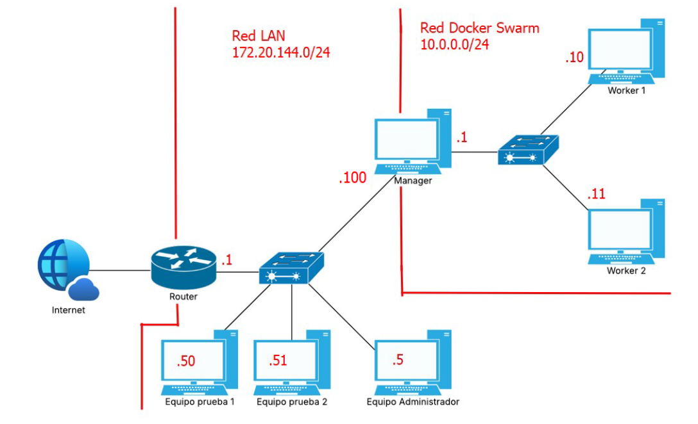

# Configuración de red
El objetivo de este apartado es configurar correctamente las direcciones IPs de los equipos que van a conformar la Docker Swarm.\
A continuación se muestra un ejemplo de implementación del proyecto en caso de que se quiera implementar dentro de una **Red LAN** convencional.

## Red LAN
Red desde la que el administrador accede al nodo manager.
El manager actúa como enrutador entre la red LAN y la red Swarm.

## Red Swarm
Red interna a través de la cual se comunican el manager y los workers.
Los workers no son accesibles directamente desde la red LAN.

# Otros casos de uso
El proyecto también se puede implementar estando expuesta directamente a Internet, ya sea contratando una dirección IP fija con tu ISP o conectando el nodo manager directamente al router, configurándo éste último con una DMZ que apunte al nodo manager.

# Configurar el manager como enrutador
Independientemente de si se decide implementar el proyecto para uso interno (sin estar expuesta a Internet), contratando una dirección IP con tu ISP o configurando el router con una DMZ, los nodos worker necesitarán tener conexión a Internet para poder descargar las imágenes de docker en caso de no tenerlas ya descargadas.
Para hacer esto añade las siguientes líneas al crontab del manager con `sudo crontab -e`:

    @reboot echo 1 > /proc/sys/net/ipv4/ip_forward
    @reboot iptables -I FORWARD 1 -i <interfaz_Swarm> -o <interfaz_LAN> -j ACCEPT
    @reboot iptables -I FORWARD 2 -i <interfaz_LAN> -o <interfaz_Swarm> -m state --state RELATED,ESTABLISHED -j ACCEPT
    @reboot iptables -t nat -I POSTROUTING 1 -o <interfaz_LAN> -j MASQUERADE

Sustituye <interfaz_LAN> y <interfaz_Swarm> por los nombres
de tus interfaces de red (ej: ens18, ens19).

## Antes de continuar
Una vez configurada la red, continúa con
[03-swarm-setup.md](03-swarm-setup.md)